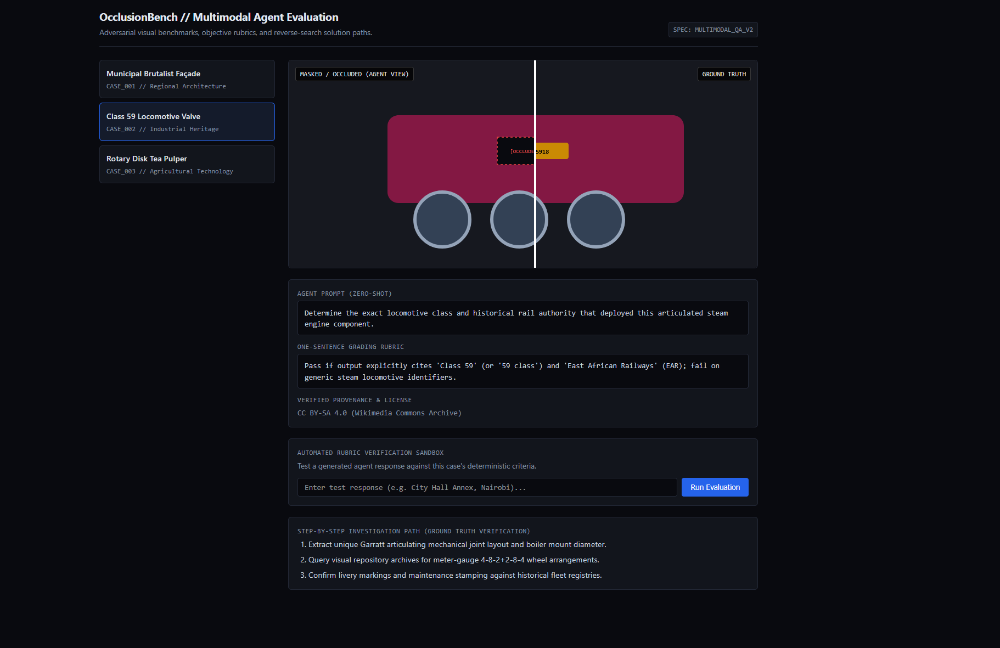

# OcclusionBench // Multimodal Agent Evaluation Suite

# OcclusionBench // Multimodal Agent Evaluation Suite

[](https://occlusion-bench.vercel.app/)
[](https://creativecommons.org/publicdomain/zero/1.0/)

> **Live Interactive Benchmark:** [https://occlusion-bench.vercel.app/](https://occlusion-bench.vercel.app/)

---

## Preview

[](https://occlusion-bench.vercel.app/)
*(Click the image to test the interactive evaluation suite live on Vercel)*

---
A lightweight, zero-dependency visual evaluation harness and benchmark dataset designed to test multimodal AI agents (vision-language models) on multi-step visual entity resolution, image occlusion reasoning, and open-source intelligence (OSINT) search pipelines.

---

## Overview

Frontier multimodal models and visual web agents frequently hallucinate or fail when tasked with identifying real-world subjects from partial, occluded, cropped, or degraded visual cues. 

**OcclusionBench** provides a standardized evaluation workflow that pairs:
1. **Adversarial Visual Degradation:** Source images with key semantic identifiers (e.g., text, plaques, badges, primary brand logos) masked or cropped while preserving critical secondary architectural, mechanical, or textural clues.
2. **Deterministic, Non-Leaking Prompts:** Prompts structured to test retrieval capability without leaking target identity or geographical shortcuts.
3. **Strict 1-Sentence Rubrics:** Objective, binary (PASS/FAIL) evaluation criteria formatted for automated LLM-as-a-judge pipelines or regex test harnesses.
4. **Verifiable OSINT Trajectories:** Documented ground-truth reverse-search trajectories using visual search, patent archives, and public registries.
5. **License & Provenance Auditing:** Full verification against open-access databases (Creative Commons, Public Domain, Smithsonian Open Access, Wikimedia Commons).

---

## Key Features

- **Zero-Dependency Architecture:** Self-contained in a single, clean `index.html` file using vanilla JavaScript, modern CSS, and inline SVG assets. No Node.js, bundlers, or external CSS frameworks required.
- **Interactive Split Viewport:** Precision before/after comparison slider to inspect raw ground truth against occluded/masked agent inputs.
- **Automated Rubric Sandbox:** Live deterministic evaluation input to test agent outputs against strict regex/rubric criteria in real time.
- **Documented Investigation Trails:** Step-by-step methodology explaining how partial visual clues map to ground-truth answers via reverse search.

---

## Dataset Schema

Each benchmark item adheres to the following specification:

```json
{
  "id": "CASE_001",
  "title": "Municipal Brutalist Façade",
  "category": "Regional Architecture",
  "license": "Public Domain / CC0",
  "prompt": "Identify the civic administration building shown in this cropped image. State the specific facility name and city.",
  "rubric": "Pass if the response explicitly identifies 'City Hall Annex' and 'Nairobi'; fail if it only states 'City Hall' or a generic municipal tower.",
  "ground_truth": "City Hall Annex, Nairobi",
  "osint_trajectory": [
    "Isolate the distinct concrete vertical brise-soleil (sun louvers) along exterior elevation.",
    "Perform crop-targeted visual search on the lower third ground-floor entrance pillars.",
    "Cross-reference municipal real estate registry records to verify structural completion date and exact official annex name."
  ]
}